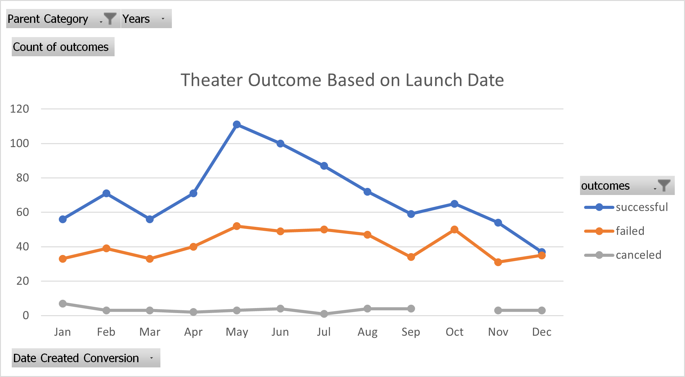
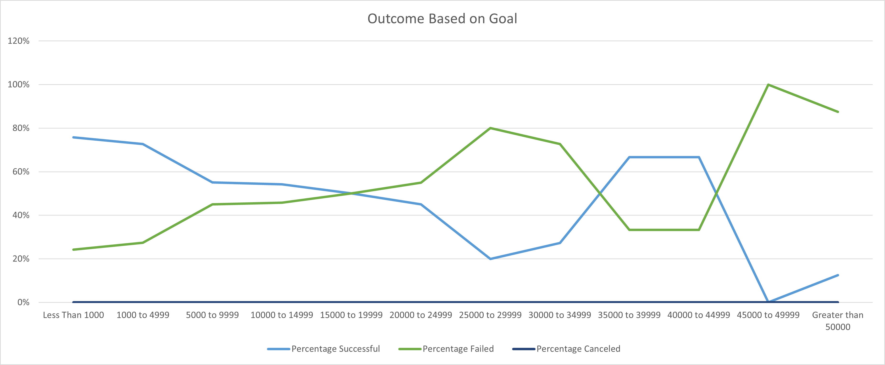

# Kickstarting with Excel

## Overview of Project

### Purpose

The purpose of this analysis is figured out the outcome and results of Louise campaingn based on the original funding goals and their launch date.

## Analysis and Challenges

These analysis were performed using pivot chart line graph and regular line graph.

### Analysis of Outcomes Based on Launch Date

### Analysis of Outcomes Based on Goals

### Challenges and Difficulties Encountered

Some Challenges encounter where using the CountIFs function. At first i did not know there were two countif function countif and countifs. Understand how the countifs range works was
also a challenge to figure out but with fews google searches and resourses it because clear. Also the video provided in canvas was a big help in formatting the countifs parameters.

One other challenge encountered was making the x axis display percentage rather than just the number.

## Results

- What are two conclusions you can draw about the Outcomes based on Launch Date?

Based on the Outcomes based on Lauch Date we can infer that from april to july the success rate was higher than normal and after November it droped.
The Failed rate was pretty stable across the year and the canceled rate was low.

- What can you conclude about the Outcomes based on Goals?

Based on the the Outcomes based on Goals we can infer that almost 80% of the succes came from the amount less than $1000 and 0-10 percent success came from the amount greather than 
$45,000. 

- What are some limitations of this dataset?

The Limitations of this dataset is that we don't have any information on the mean, standard deviations or the outliers.

- What are some other possible tables and/or graphs that we could create?

Quatile, Outliers and Standard Deviation.
